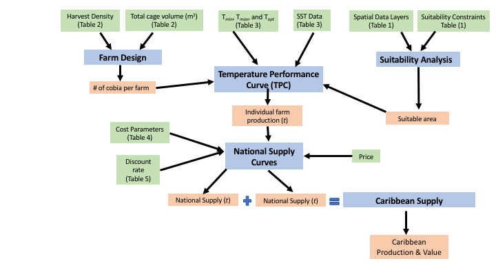

```{r setup, warning=FALSE , echo=FALSE}
knitr::opts_chunk$set(echo = FALSE, message = F, warning = F, fig.width = 6.5)
```

```{r load_run, echo=FALSE}
library (hrbrthemes)
library(tidyverse)
library(knitr)
#library(Cairo)
library(tmap)
library(rgdal)
library(pander)
library(raster)
library(ggmap)
library(maptools)
library(maps)
#library(rworldmap)
library(pander)
library(RefManageR)
# data(World)

# Source functions
source(file = '../functions/plot_map.R')

## Read in Bibliography info from Zotero.org
biblio <- ReadZotero(group = '1859663', .params = list(collection = '3547HZA9'))

# Find article keys to reference when in citations
refs <- biblio %>% {
  .$title
} %>%
  bind_rows() %>%
  gather(key = 'key', value = 'title', 1:ncol(.))

## Set document themese
font_family = 'Calibri'
font_size = 18
paper_theme <-  theme_ipsum(base_family="Calibri",base_size = 18,
                          axis_title_size = font_size)
theme_set(paper_theme)

## Set User (lennon/tyler) for rendering
user <- 'tyler'

if(user == 'lennon') { boxdir <- '/Users/lennonthomas/Box Sync/Waitt Institute/Blue Halo 2016/Carib_aqua_16/'}
if(user == 'tyler')  { boxdir <- '../../../Box Sync/Carib_aqua_16/'}

# Specify run directory to source results from
run_name = "2018-02-27_est"
run_dir<-paste(boxdir,'results/',run_name, "/" ,sep = "")

## Read in data tables
table1<-read.csv("table_1.csv",stringsAsFactors = FALSE,fileEncoding="latin1")
table3<-read.csv("table2a.csv",check.names=FALSE)
table4<-read.csv("costtable.csv",check.names=FALSE)
#table5<-read.csv(paste0(boxdir,"results/Suitability/suit_by_variable.csv"),check.names=FALSE)
table6<- read.csv(file = paste0(boxdir,filename = "results/Suitability/Suit_df_summary.csv"))

# Suitable area summary calcs
total_suitable_area<-sum(table6$Suitable.area)
total_study_area<-sum(table6$Total.EEZ.area)
percent_suitable<-total_suitable_area/total_study_area*100

# Caribbean seafood production
carib_production <- read_csv(file = paste0(boxdir, 'data/carib_seafood_2014.csv'))

# 2014 total production
carib_prod <- carib_production %>% 
  summarize(prod = sum(Production_MT, na.rm = T)) %>% .$prod

# 2014 aquaculture production
carib_aqua_prod <- carib_production %>% 
  filter(Type != 'Fisheries') %>% 
  summarize(aqua_prod = sum(Production_MT, na.rm = T)) %>% .$aqua_prod

# 2014 fishery production
carib_fish_prod <- carib_production %>% 
  filter(Type == 'Fisheries') %>% 
  summarize(fish_prod = sum(Production_MT, na.rm = T)) %>% .$fish_prod

# NPV results
carib_supply <- read_csv(file = paste0(run_dir,"Results/supply_summary.csv"))

# Load EEZ shapefile
# EEZ = readOGR(dsn=paste(boxdir,"Suitability/tmp",sep = ""),layer="carib_eez_shape")
# 
# # Load country suitability results
# 
# 
# carib_countries<-c("Anguilla Exclusive Economic Zone",
#                    "Antigua and Barbuda Exclusive Economic Zone",
#                    "Aruban Exclusive Economic Zone",
#                    "Bahamas Exclusive Economic Zone",
#                    "Barbados Exclusive Economic Zone",
#                    "Bonaire Exclusive Economic Zone",
#                    "British Virgin Islands Exclusive Economic Zone",
#                    "Cayman Islands Exclusive Economic Zone",
#                    "Curaçaoan Exclusive Economic Zone",
#                    "Cuban Exclusive Economic Zone",
#                    "Dominican Exclusive Economic Zone",
#                    "Dominican Republic Exclusive Economic Zone",
#                    "Grenadian Exclusive Economic Zone",
#                    "Guadeloupean Exclusive Economic Zone",
#                    "Haitian Exclusive Economic Zone",
#                    "Jamaican Exclusive Economic Zone",
#                    "Martinican Exclusive Economic Zone",
#                    "Montserrat Exclusive Economic Zone",
#                    "Puerto Rican Exclusive Economic Zone",
#                    "Saba Exclusive Economic Zone",
#                    "Saint-Barthélemy Exclusive Economic Zone",
#                    "Sint-Eustatius Exclusive Economic Zone",
#                    "Saint Kitts and Nevis Exclusive Economic Zone",
#                    "Saint Lucia Exclusive Economic Zone",
#                    "Saint-Martin Exclusive Economic Zone",
#                    "Saint Vincent and the Grenadines Exclusive Economic Zone",
#                    "Sint-Maarten Exclusive Economic Zone",
#                    "Trinidad and Tobago Exclusive Economic Zone",
#                    "Turks and Caicos Exclusive Economic Zone",
#                    "Virgin Islander Exclusive Economic Zone")
# 
#   # load(paste(boxdir,'Suitability/results/suitability_results.Rdata',sep=""))

```

# Abstract

The development of marine aquaculture in the Caribbean has been identified as an avenue to stimulate local economies, increase employment opportunities, and improve seafood supply and food security. However, when located close to shore, aquaculture’s environmental impacts can jeopardize valuable habitats (e.g., mangroves, coral reefs, seagrass beds) and competition for coastal space can lead to conflicts with fisheries, tourism, and other uses. Farming further offshore is a possible option for alleviating these stresses. Using high-resolution environmental and economic data, we develop a spatial bio-economic model to identify suitable areas throughout the Caribbean for offshore finfish aquaculture, parameterized based on cobia (*Rachycentron canadum*), and to estimate potential outcomes in terms of yields and profits under different market scenarios. We find that Caribbean nations contain `r prettyNum(total_suitable_area,big.mark=",")` km^2^ (`r round(percent_suitable, digits = 2)`%) of marine space technically feasible for cobia aquaculture and capabale of producing XX MMT of seafood, an amount roughly comparable to the total global production from capture fisheries. Accounting for spatial differences in cobia growth and production costs, we estimate the offshore cobia aquaculture production potential of the Caribbean to be `r round(carib_supply$total_supply[84] / 1e6, digits = 0)` million MT. Areas associated with the highest relative economic potential were X, X, and X. Offshore aquaculture is a capital intensive activity mediated by socioeconomic conditions, such as foreign investment risk and XX, which were found to be factors limiting production in our analysis. The results of this research can be used to help prioritize areas for offshore cobia aquaculture development and as a framework for identifying priority areas for offshore aquaculture of other species. Additionally, we discuss the future potential of the development of offshore aquaculture in the Caribbean.


# Introduction 

Global fish production is expected to exceed 151 million tons by 2030 to meet  growing demands, a 10% increase over current levels [@Kobayashi2015; @FAO2016], and the vast majority of new production must come from aquaculture given only modest potential increases from capture fisheries [@Costello2016]. Aquaculture seems poised to meet this challenge as the fastest growing food production sector globally, surpassing wild fisheries production for the first time in 2014 [@FAO2016]. Marine aquaculture, or mariculture, is seen as having particularly strong growth potential [@Merino2012]. And as mariculture technology advances, production from offshore mariculture, generally defined as occurring more than three nautical miles offshore and/or in depths of greater than 30 m [@Froehlich2017], is expected to increase [@FAO2016].  By moving to deeper waters further from the coast, offshore aquaculture could be a viable strategy to minimize aquaculture's adverse environmental and socioeconomic consequences [@Holmer2009; @Froehlich2017], and production potential in the offshore realm far exceeds seafood demand for the foreseeable future [@Kapetsky2013; @Gentry2017]. Despite strong arguments for offshore aquaculture development, how this growth can and should be realized requires an understanding of the sustainable and economically-viable production potential at the regional level, along with an identification of hurdles impeding development.

In recent years, there has been a growing interest in aquaculture development in the Caribbean to increase food security and economic development [@VanWyk2006; @Creswell2007; @CRFM2014; @Perez-Ramirez2017]. In 2014, the Caribbean produced `r prettyNum(carib_prod, big.mark = ',')` MT of seafood, `r round(100 * (carib_fish_prod / carib_prod), digits = 2)`% of which came from capture fisheries. In contrast, only `r prettyNum(carib_aqua_prod, big.mark = ',', digits = 0)` MT was produced from aquaculture, accounting for < 0.1 % of the global total.  

```{r}
knitr::include_graphics(path = paste0(boxdir,'results/carib_seafood_production.png'))
```


Currently, over 88% of seafood consumed in the Caribbean is from wild capture fisheries [@FAO2016]. To meet seafood demand in the region, over 144,000 mt of seafood, valued at XX $USD, is imported annually [@FAO2016]. Furthermore, seafood consumption per capita in the Caribbean is projected to increase rapidly (22%) over the next decade [@FAO2016]. Wild fisheries production in the region is unlikely to play a meaningful role in decreasing exports and/or meeting growth in demand because of overfishing, degradation of coral ecosystems, and climate change [@Burke2011;@Perez-Ramirez2017]. Aquaculture development could be an opportunity for Caribbean countries to diversify their economic activities, reduce reliance on foreign imports, provide jobs and economic security to local residents (**FAO 2002**), and to promote a seafood industry that is more resilient to the effects of climate change [@Perez-Ramirez2017]. 

Most aquaculture efforts in the Caribbean have been directed towards land-based aquaculture of tilapia (*Oreochromis sp.*) and coastal pond aquaculture of white-legged shrimp (*Litopenaeus vannamei*) [@Lovatelli2013]. However, the potential for increased production of land-based aquaculture in the Caribbean is extremely limited due to the requirements of land space, freshwater, and energy resources [@Alvarez-Lajonchere2013]. Similarly, expanded development of coastal aquaculture in the region is likely not sustainable and difficult due to conflicts over space in highly utilized and ecologically sensitive coastal areas [@Gentry2017a]. For example, coastal aquaculture can harm mangroves and coral reefs by increasing nutrient loads and causing physical damage to the habitat from farm infrastructure [@Benetti2006; @Gentry2017a], with cascading effects on marine-based tourism, the backbone of many Caribbean island economies [@Benetti2006]. Offshore aquaculture could be a promising alternative [@Benetti2010a; @Gentry2017], and recently developed submersible cages will allow aquaculture to be developed in areas that were previously considered unsuitable due to waves, depth and/or high risk of damage from large storms and hurricanes (@Benetti2010a). 

Environmental conditions in the Caribbean such as relatively small seasonal fluctuations in ocean temperature and a stable water column provide ideal conditions for the offshore culture of a number of species (REF).  Small-scale trials raising cobia (*Rachycentron canadum*), pompano (*Carangidae sp*), and red drum (*Sciaenops ocellatus*) in offshore environments were successful in the Bahamas and Puerto Rico (Benetti et al. 2010). Cobia in particular has been identified as an ideal candidate species for aquaculture in tropical and subtropical regions because of its relatively fast growth rates, high market value, and tolerance for variations in salinity and temperature [@Alvarez-Lajonchere2013; @Benetti2010; @Estrada2016]. The largest open ocean mariculture farm in the world, Open Blue, has been successfully culturing cobia off the Caribbean coast of Panama since xxxx.

Critical knowledge gaps that hinder the development of offshore aquaculture in the Caribbean include: 1) the bioeconomic production capacity of the region (CRFM 2015), 2) how that potential varies across EEZs, and 3) what factors are currently most likely to be limiting development (e.g., biophysical conditions, regulatory environment, capital investment, expertise, etc.). Using high resolution spatial data, we develop a bioeconomic model to estimate the total production potential (in terms of weight and revenue) of offshore cobia aquaculture in the Caribbean. We examine the spatial distribution of offshore aquaculture potential to identify ‘hotspot’ locations for future development. We examine the variation of individual farm profitability between and across EEZs to determine the importance of site selection in aquaculture development and to quantify the potential benefits of strategic spatial planning.  We explore these results under several scenarios of cobia production using a supply and demand curve to set cobia market price. Our approach could be applied to other farmed species or applied to other regions, and our results can help to chart a course for a sustainable and economically prosperous offshore mariculture industry in the Caribbean.

# Methods 

## Description of Study Region 

Our study domain includes the territorial waters and Exclusive Economic Zones (EEZs) surrounding the 28 island countries that comprise the Greater and Lesser Antilles of the Caribbean Sea (Figure 1). All analyses are performed at a 1 km^2^ spatial resolution. We do not consider the potential of offshore aquaculture development in the high seas or disputed waters. A shapefile from VLIZ [-@VLIZ2014] is used to define the maritime boundaries for all island countries. 

```{r fig1.tmap, fig.cap="The study area for this project is indicated in blue. EEZ boundary data were obtained from VLIZ (2016)."}
include_graphics(path = paste0(run_dir,'Figures/study_area.png'))
```


## Overview

We develop a spatial bioeconomic model to estimate the production potential (in terms of biomass (*t*) and Net Present Value (NPV)) for offshore cobia mariculture in the Caribbean region (Figure 1). The first steps of our analysis are to identify 1 km^2^ sites throughout the study region that would be suitable for mariculture development and create a hypothetical farm design to apply to all suitable sites. Next, we apply a temperature performance curve (TPC) to predict temperature-dependent growth of cobia at each farm and we establish supply curves to determine national and Caribbean-wide cobia production that would be achieved under several scenarios of cobia price and production costs. We also consider a scenario where Caribbean production affects the global price of cobia. Finally, we use our production model and estimated economic parameters to calculate NPV over a 10 year time horizon. We assume that only farms that have a positive NPV will be developed.

```{r,  fig.cap="Model schematic for estimating cobia aquaculture production potential. Green squares indicate model inputs, blue squares indicate model components, and orange squares indicate model outputs."}

#
```


## Suitability Assessment 

The first step in our analysis identifies areas that are potentially suitable for the development of offshore mariculture. To determine what areas are suitable, we consider six factors: depth, current speed, coral reef presence, shipping activity, oil structures, and areas designated for conservation (Table 1). 

```{r table1, results='asis'}
# Make table of suitability data layers
tbl1 <- table1 %>%
  rename(
    Layer       = Spatial.Data.Layer,
    Source      = Data.Source,
    Description = Data.and.Analysis.Description,
    Criteria    = Suitability.Criteria) %>%
  dplyr::select(-Description)

pander::pandoc.table(tbl1, 
             digits = 2,
             split.tables = Inf,
             # split.cells = c(15,5,120,15,10),
             # justify = c("center","center","center","center","center"),
             caption = "Description of spatial data layers and criteria used to identify cells suitable for development of offshore aquaculture in the Caribbean")
```

Our suitability assessment assumes the use of SeaStation cages, which are submersible, self-tensioned, single rim cages and are the most widely used offshore aquaculture cages in the U.S. [@Loverich2010]; Open Blue 2016. The minimum site depth for installation of a SeaStation cage, listed by the original manufacturer, is 25 m (OceanSpar 2013). The maximum suitable depth for cage installation for this analysis is set at 100 m because, in waters deeper than 100 m, cage installation and inspection of mooring and anchoring systems are more difficult and costly **scott_offshore_2000**; [@Kapetsky2013]. Using spatial bathymetry data for our study region, areas within a 25 - 100 m depth are scored as suitable for offshore mariculture development. Additionally, SeaStation cages are not recommended in areas with current velocities over 1 m/s (Loverich 2010). To identify areas with unsuitably high current velocities, we use 10 years (2005-2015) of  5 day average zonal and meridional current velocity. The absolute maximum zonal and meridional average daily velocities that occurred over the 10-year time period are extracted for each cell, and any cell with a maximum zonal or meridional velocity greater than 1 m/s are scored as unsuitable. To minimize the ecological impact of offshore mariculture development, we also identify as unsustainable any cells with coral reef habitat.

To identify areas currently designated or utilized for purposes that would preclude offshore mariculture development, we use spatial data on: shipping activity, existing benthic oil structures, areas permitted for deep sea bed mining, and areas that have been designated as Marine Protected Areas (MPAs) or conservation priority areas (Table 1). Areas that fell in the 10% of the highest relative shipping activity areas designated for conservation or deep sea bed mining purposes, and areas with existing benthic oil structures, are considered unsuitable for offshore mariculture development. 

All spatial data layers listed in Table 1 are converted to raster format with a 1 km^2^ spatial resolution. Data files that had a resolution > 1 km^2^ are interpolated to the 1 km^2^ grid using 'nearest neighbor technique' in R's [raster](https://cran.r-project.org/web/packages/raster/index.html) package. All 1 km^2^ cells from each layer that fell outside of the suitable threshold are given a score of zero and cells falling within the threshold are given a score of 1. We then overlay all data layers and multiply the values of all layers in each cell. This result is a final single data layer, where cells suitable for offshore aquaculture development based on all criteria listed in Table 1 have a score of 1, and unsuitable cells a value of 0.

## Growth Potential
Temperature is one of the primary abiotic factors controlling growth in ecotherms, including cobia [@Brett1979], and is a factor that cannot be easily controlled in offshore mariculture grow-out settings [@Tidwell2012]. To reflect spatial differences in productivity across farms attributed to temperature variations, we use 10 years of remotely-sensed sea surface temperature (SST) data (NASA 2014) to calculate 1 km^2^ resolution spatial data layers of average monthly SST. We then use a thermal performance curve (TPC) to model temperature dependent individual somatic growth ($G$, kg per month) of cobia for each farm site (Klinger, Levin, & Watson 2017).  

### Thermal Performance Curve
The TPC is a temperature-dependent piecewise linear function defined as follows:

$$ 
G(T) = \Big\{\begin{array}
{rr}
a_1T - b_1 ~~~ if ~~ T<T_o \\
a_2T + b_2 ~~~ if ~~ T\ge T_o
\end{array}  
$$

where $T$ is sea surface temperature in degrees C, $T_o$ is the optimal temperature for cobia growth in $^\circ$C, and $a_1$ and $a_2$ are slope parameters (kg per month per degree C), and $b_1$, and $b_2$ are intercept parameters (kg per month). At temperatures below the minimum temperature for growth ($T_{min}, b_1/a_1$) and above the maximum temperature for growth ($T_{max}, -b_2/a_2$), $G$ is forced to 0 to reflect the absence of growth. Where $a_2$ is negative, $T_o = (b_1 + b_2) / (a_1 - a_2)$. The following values and references for temperature-growth components of cobia were adopted from Klinger, Levin, and Watson (2017), who also used a TPC to model cobia growth.

```{r table2, results = 'asis'}
temp_params <- data_frame(Parameter = c('Tmin',
                                        'Topt',
                                        'Tmax',
                                        'Growth rate (g/month)',
                                        'a1','a2','b1','b2'),
                          Value = c(22,29,32,0.5,0.0714,-0.1667,-1.5714,5.3333))


pander::pandoc.table(temp_params, 
             digits = 2,
             split.tables = Inf,
             # split.cells = c(15,5,120,15,10),
             # justify = c("center","center","center","center","center"),
             caption = 'Temperature-growth parameters and linear function constants for cobia')
```

Individual cobia growth at month $t$ for site $i$ ($G_{i,t}$) is estimated using the TPC for all 120 months in the SST timeseries. The 10 year ($y$) average individual growth ($\bar{G}_{i,t} $) at site $i$ is then calculated for each calendar month $t$:

$$\bar{G}_{i,t} = \frac{\sum_{y=1}^{10} G_{i,t,y}}{10} $$

## Bioeconomic Model
We model future offshore aquaculture potential in the Caribbean by coupling site specific estimates of average monthly cobia growth with a detailed farm design and economic model parameterized with values from the literature and technical reports. For each site, we calculate the projected net present value (NPV) from the discounted stream of costs and revenues. We then limit our discussion of results to only include farms (cells) with a positive NPV under the assumption that only profitable farm locations would be developed.

### Farm Design 
To estimate production, we assume a fixed farm design, per 1 km^2^ site, across our study region. SeaStation cages are typically configured using a mooring system that includes a grid, anchor, and mooring lines secured at varying distances from the cages [@Fredriksson_2004; @Xu2015].We develop a hypothetical farm design for a 1 km^2^ cell that has 16 SeaStation cages (each 6,400 m^3^) configured in two eight-cell grid mooring systems that occupy a total space of approximately ~ 0.48 km^2^ and provide a total cage capacity of 102,400 m^3^ (Figure 2). The cages are held in position by the mooring system at depths of 15-20 m below the surface[@Loverich2010]. This cage configuration is similar to a 0.4 km^2^ offshore mariculture farm located off the coast of Kona, Hawaii that has an eight-cage SeaStation array with a total cage volume of 64,000 m^3^ [@Sims]. 

The total cage volume per unit of total farm area for our hypothetical farm design falls within the range of total cage volume per unit farm area for the Kona farm [@Sims] and another offshore farm using SeaStation cages in the Gulf of Maine [@Fredriksson2004]; [@DeCew2010]. Additionally, the total space occupied by the farm's infrastructure (0.48 km^2^) follows the guidelines issued in NOAA's Fishery Management Plan (FMP) for offshore aquaculture development in the Gulf of Mexico that specifies the total mariculture farm area should be twice the size of the total area occupied by farm infrastructure.

```{r table3, results='asis'}

pander::pandoc.table(table3,
             digits = 2,
             caption = 'Farm design specification for hypothetical 1 square kilometer offshore cobia farms',
             split.cells = c(80,20))
```
 

### Growth Model
Individual cobia growth at month $t$ for site $i$ ($G_{i,t}$) is modeled using the previously calculated 10 year ($y$) average individual growth ($\bar{G}_{i,t} $) at site $i$ for calendar month $t$. Fingerlings are stocked at an initial weight of 15 grams and fish weight ($w$) in month $t$ at site $i$ is calculated as the cumulative growth since the stocking month ($t_s$):

$$ w_{i,t} = \sum_{t_s}^{t} \bar{G}_{i,t} $$

We apply an instantaneous mortality rate of 0.024, which we adopt from previous studies that have estimated a total 12 month survival rate of 75% for cobia raised in offshore cages in the Caribbean ([@Benetti2008c; @Huang2011]). A cage at site $i$ is harvested when individual fish have grown to a harvestable size of 5 - 6 kg. 

#### Stocking Density
XX suggest $15 \frac{kg}{m^3}$ as a target harvest density for sustainable offshore mariculture. Because growth rates vary across farm sites and all sites are assumed to experience an instantaneous mortality rate of 0.024, we calculate the optimal initial number of stocked fingerlings ($n_0$).The number of fingerlings stocked in each cage is optimized at the level that achieves the target harvest density ($15 \frac{kg}{m^3}$) at the time fish reach the final harvest weight of 5 kg, or 19,200 fish per cage. 

The optimal stocking number ($n^*$) for each site is estimated using the historical SST timeseries. The number of hypothetical completed grow out cycles ($g$), wherein a cobia is raised from an initial stocking weight of 0.15 g to a final harvest weight of 5 kg, is calculated for each site $i$ by first dividing the cumulative individual growth over the 120 month timeseries by the target harvest weight. 

$$g_i = \frac{\sum_{t=1}^{120} G_{i,t}}{5~kg} $$  

The average number of months per grow out cycle ($\bar{t}_i$) is then calculated as $\bar{t}_i = \frac{120}{g_i}$. Given $\bar{t}_i$ and the target harvest of 19,200 5 kg fish, the optimal number of fingerlings ($n^*_i$) to stock can be estimated for each site $i$ as follows:

$$ n^*_i = \frac{19,200}{1-(1-e)^{0.024~\bar{t}_{i}}} $$
For a farm site with a 12 month average harvest cycle ($\bar{t}_i=12$), $n^*$ is 25,600.

#### Total Biomass
Total site biomass in each month ($B_{t,i}$) is a function of the number of stocked cages $C$, initial stocking number $n_0$, and the instantenous mortality rate [@Benetti2008c]. 

$$ B_{i,t} =  \displaystyle\sum_{c = 1}^{C} w_{c,t,i} n_{0,i} - n_{0,i} (1-e)^{-0.024~t} $$

Where $C$ is the number of stocked cages at site $i$, $w_{c,i,t}$ is the weight of individual fish in cage $c$ in month $t$, and $n_{0,i}$ is the initial number of fish stocked per cage at site $i$.
 
### Economic Model

#### Costs
The total cost $TC$ of production for each farm $i$ consists of start up costs ($SC$) plus the sum of operating costs ($OC$). Cost parameters were obtained from published literature or from personal communication with industry experts (Table 5) 

$$ TC_i = SC_i + \displaystyle\sum_{t=1}^T OC_{i,t} $$

Costs of aquaculture infrastructure and installation increase with depth and distance from shore [@Beverage2004]. Start-up costs are therefore modeled to include initial capital expenditures ($E$) and installation costs ($I$), both as a function of average site depth in meters $m$, and EEZ-specific permit and/or lease cost $P$:

$$ SC_i =  E_i(m_i) + I_i(m_i) + P_{z} $$
Initial capital expenditures ($E$) include the cost of 16 SeaStation fish cages ($269,701 each) plus the cost of one 16-m-long support vessel and two 7-m-long motorboats. Installation costs include the labor costs for installation of the culture system. A 10% increase in cage and installation costs are assinged to sites with depths greater than 50 m [@Lester2017].

$$ E_i = \begin{cases} 
   4,315,216 + (4,315,216 * 0.1) + 158,331 & \text{if } m_i > 50\\
   4,315,216 + 158,331 & \text{if } m_i \leq 50
   \end{cases} 
 $$
$$ I_i = \begin{cases} 
   52,563 + (52,563 * 0.1) & \text{if } m_i > 50\\
   52,563 & \text{if } m_i \le 50
   \end{cases} 
 $$

Operating costs are organized in two main categories; farm labor and maintenance costs as a function of site depth and EEZ-specific hourly salary and fuel costs ($L_{i,t}(s_z,d_i,g_z)$), and costs associated with purchasing and feeding stocked fish $F_{i,t}$. 

$$ OC_{i,t} = L_{i,t}(s_z,d_i,g_z) + F_{i,t}(n_{0,i,t}) $$

Labor and maintenance costs ($L$) at site $i$ in month $t$ are modeled as follows: 

$$ L_{i,t} = 2,720s_z + \frac{d_i}{3,219}60g_z  $$

Where 2,720 is the total monthly labor hours required at site $i$ (17 full time workers); $s_z$ is the EEZ-specific hourly salary; $d_i$ is distance from shore (in meters); 3,219 is average fuel efficiency (meters per gallon); 60 is the number of one-way trips required per month for running the farm; and $g_z$ is the per-gallon cost of fuel as a function of EEZ. 

Fingerling and feed costs ($F$) at site $i$ in month $t$ include the cost of an individual fingerling (\$2.58) times the number of fingerlings stocked in month $t$ ($n_{0,i,t}$). Feed costs are calculated based on a constant feeding strategy of 2% of total biomass and a feed price of \$1.68 per kg. Because our model operates at monthly, not daily, timesteps, we calculate total feed based on the average total biomass during month $t$  $\frac{B_{i,t} + B_{i,t-1}}{2}$.

$$ F_{i,t} = 2.58n_{0,i,t} + 1.64 * 0.02(\frac{B_{i,t} + B_{i,t-1}}{2})   $$
```{r,results='asis'}
rownames(table4) <- NULL
pander::pandoc.table(table4,
                     big.mark = ',',
                     split.tables = Inf,
                     round = 2,
                     digits = 2,
                     caption = "Table XX: Cost parameters used in the bioeconomic model for cobia offshore aquaculture")
```

#### Revenue

Farms earn revenue by harvesting market weight (5 kg) cobia. Thus, farms only earn revenue in months where individual fish weight ($w$) reaches 5 kg. In these harvest months, farm revenue is simply a function of harvest weight (kg) and cobia price ($p$), $R_{i,t} = B_{i,t}p_t$, otherwise $R_{i,t} = 0$:

$$ R_{i,t} = \begin{cases} 
   B_{i,t}p_t & \text{if } w_{i,t} \ge 5 kg\\
   0 & \text{if } w_{i,t} < 5
   \end{cases} 
 $$

Where $B$ is the total biomass of cobia at farm $i$ in month $t$ and $p_t$ is the global price of cobia in month $t$. Cobia farms in the Caribbean are initially assumed to be price takers and thus production in month $t$ does not affect price in month $t+1$.

Total farm profit ($\pi$) for farm $i$ is then simply the sum of revenues less total farm costs.

$$ \pi_{i} = \sum R_{i} - TC_i $$

We then calculate the 10-year net present value (NPV) of farm $i$ using EEZ-specific discount rates ($\delta_{z}$) (Table 5): 

$$ NPV_i = \displaystyle\sum_{t=0}^{T} \frac{\pi^i_t}{(1+\delta_{z})^t} $$

#### Discount Rate 
*(need to update and add methods used to convert to discount rate)*

Individual discount rates are determined for each Caribbean country that incorporate the foreign investment risk associated with that country. We modify previously published methodologies to quantify a country’s relative investment risk in the Caribbean, where limited data on economic and political conditions are available. Bhalla [-@Bhalla1983] developed the Foreign Investment Risk Matrix (FIRM) to assist investors in classifying the political and economic risks associated with investing in different countries using discrete risk categories. An expanded version of FIRM was developed by McGowan and Moeller [-@McGowanJr2009] that utilizes three political and three economic continuous risk variables that are readily available for most countries. 

Limited data were available for the risk variables described by McGowan and Moeller [-@McGowanJr2009] for Caribbean island countries. Only three countries in our study have data available for the “conflict” variable and only nine have data available for all five of the other McGowan and Moeller risk variables. Therefore, to calculate risk scores for the island countries in our region, we identify comparable, substitute risk variables for each of McGowan and Moeller’s risk variables. We then calculate Pearson’s correlation coefficients and significance vales between McGowan and Moeller’s risk variables and our selected substitute variables using countries with data available for both sets to validate our substitute variables (Table XX). Although there are not enough data for the conflict variable in the Caribbean to calculate a correlation coefficient, we assume WRI’s political stability score to be a logical substitute.

Averages of political and economic variables are calculated by removing any variables for which data qre not available for that country. In some cases this means that the only data available to calculate a final relative risk score is GDP per capita. Bhalla (1983) states that GDP per capita is one of the most important variables determining both political and economic risk because income per capita reflects both the underlying economy and the effectiveness of political management. For the 14 countries with data available for all variables, we find GDP to be a significant (r = 0.88, *p*-value = < 0.001) predictor of the final risk score, providing further support for this approach (Figure 1).

For each variable, a country’s rating is determined by transforming the data for that variable to a scale of 1 (low risk) to 5 (high risk) and multiplying by the specified weight to determine the variable’s final score (R x W) (Table 3). Political and economic risk scores are calculated by taking the sum of final scores for all three variables, and the total risk score is calculated by multiplying the political and economic risk scores by the specified weight and summing the values (Table 3). The weights shown in Table 3 were arbitrarily chosen by McGowan and Moeller [-@McGowanJr2009]. In practice, they recommend weighting variables according to relevance and importance to the particular project that is being assessed. For this analysis, all political and economic variables are given equal weight.

### Supply

Using the cost function described in equation X, we construct national and Caribbean-wide supply curves for cobia by aggregating farm-level supply curves. For a given price, only farms with a positive 10-year NPV are considered feasible for development. We then calculate, for each EEZ ($z$) the harvested biomass (in metric tons), $H_z$, and NPV ($NPV_z$) over a 10-year period produced by all profitable farms in an EEZ across a range of prices (X-XXX).  

$$ H_z = \displaystyle\sum_{i}^{I} H_i $$

$$ NPV_z = \displaystyle\sum_{i}^{I} NPV_i $$

National supply curves are aggregated into a single Caribbean-wide supply curve to estimate total potential cobia production ($H_Z$) and NPV ($NPV_Z$) for the Caribbean over a 10-year period. 

$$ H_{Z} = \displaystyle\sum_{z}^{Z} H_{z} $$

$$ NPV_{Z} = \displaystyle\sum_{z}^{Z} NPV_{z} $$

# Results

## Suitability Assessment 

Based on the factors and criteria described in Table 1, we find a total of  `r prettyNum(total_suitable_area,big.mark=",")` km^2^, or `r round(percent_suitable, digits = 2)`% of EEZ area in the Caribbean, suitable for offshore aquaculture development (Figure 3).

```{r}
knitr::include_graphics(path = paste0(run_dir,'Figures/carib_suit_area.png'))
```

The suitable area based on each of the factors considered in our analysis are listed in Table 5.
*Add Table*

Depth is the largest constraining factor, with less than 2% of the total study area within the suitable depth range required for deployment of offshore SeaStation cages. Deep sea mining did not eliminate any areas because currently no deep sea bed mining permits have been issued in the region. However, this may be an important factor to consider in other regions or in the future in the Caribbean. 

There is considerable variability in the amount of area suitable for offshore mariculture in Caribbean nations (Table XX). Both the Bahamas and Trinadad and Tobago have more than twice the suitable area than the country with the next largest amound of suitable area (Jamaica) 

```{r table6, results='asis'}
rownames(table6) <- NULL
pander::pandoc.table(table6,
                     big.mark = ',',
                     col.names = c('Country','Suitable area (km^2)', 'Total EEZ area (km^2)', '% suitable'),
                     round = 2,
                     digits = 2,
                      split.tables = Inf,
                     caption = "Table XX: Estimated suitable area (km^2^ by EEZ)")
```

### Suitable Farm Production

If economic constraints are ignored and all suitable farm sites are developed, the Caribbean's potential to produce cobia from mariculture is extremely large, with an approximate annual production of XXX MT (XXX% of total current seafood production in the region). 

```{r fig , fig.cap = "Estimated total production of cobia (mt) using if all suitable areas are developed as offshore mariculture farms "}
include_graphics(path = paste0(run_dir,'Figures/total_prod_map.png'))
```

## Bioeconomic Model Results

When only farms that are profitable over a 10 year period are developed, 17 countries develop farms and produce XX mt annually.

```{r fig.height = 5, fig.width = 4, fig.cap = "Total production of farms that are profitable over a 10 year period"}
include_graphics(path = paste0(run_dir,'Figures/econ_prod_map.png'))
```


```{r fig.height = 5, fig.width = 4, fig.cap = "10 year NPV of farms that are profitable over a 10 year period" }

include_graphics(path = paste0(run_dir,'Figures/econ_npv_map.png'))
```

At the farm level, the median NPV of a cobia farm in the Caribbean was `r carib_supply$median_npv[84]`, driven by high NPV farms in several countries (Figure X) 

```{r fig.cap = "NPV of cobia aquaculture per farm by Caribbean EEZ"}
knitr::include_graphics(path = paste0(run_dir, 'Figures/npv_cntry_ridgeplot.png'))
```

### Costs

Feed is currently the largest cost for aquaculture producers, and our findings support this conclusion (cite % and/or SI figure). Our results are based on the current cost of cobia feed (1.65/kg). However, given economic forces are driving promising advances in feed technology, we also explored results if feed costs are reduced by 10 %. (will summarise average values here instead of figure)

```{r, fig.cap="Break down of farm costs by EEZ"}
knitr::include_graphics(path = paste0(run_dir, 'Figures/cost_cntry_barplot.png'))
```

A reduction in feed costs by 10% would increase cobia production (supply) by XXX. No farms in the Caribbean would be profitable if price for cobia drops below $8/kg at current feed costs.

```{r, fig.cap="Figure XX. Cobia supply curves under current feed cost (feed price index = 1) and a 10% reduction in feed cost (feed price index = 0.9)."}
knitr::include_graphics(path = paste0(run_dir, 'Figures/carib_supply_curves.png'))

```

A reduction in feed costs would increase production and NPV

```{r, fig.height = 5, fig.width = 4, fig.cap = "Estimated total production of cobia (mt) and 10 year NPV for our study area assuming current feed price, and a reduction in feed price by 10% "}
include_graphics(path = paste0(run_dir,'Figures/feed_prod_map.png'))
include_graphics(path = paste0(run_dir,'Figures/feed_npv_map.png'))
```


```{r, fig.height = 5, fig.width = 4, fig.cap = "Comparison of production when all suitable farms are developed, only profitable farms, and only profitable farms with lower feed costs"}
include_graphics(path = paste0(run_dir,'Figures/production.png'))
```


## Sensitivity Analyses

Due the uncertainty of future market conditions, economic status of countries,impacts new techonological developments, and to identify the current major hurdles to the development of offshore aquaculture in the Caribbean, we perform a suite of sensitivity analyses by assuming different:

* Suitable depth range
* Discount rates
* Lower price

## Other Figures

Cobia growth is a function of temperature and, in addition to the amount of suitable area avaialable, is a major factor for cobia production. Not surprisingly then, average cobia growth (kg/month/farm) shows a clear seasonal trend, which varies across EEZs (Figure XX).

As a result of the variability in growth rates acros the Caribbean, farms vary in the length of time require to raise cobia to a market size of 5 kg, with the median farm requiring X months to complete a harvest cycle (Figure SX).


```{r fig.cap = "Average growth of cobia by month"}
knitr::include_graphics(path = paste0(run_dir, 'Figures/Caribbean_avg_growth.png'))
```


```{r fig.cap = "Average harvest cycle length (months) by farm"}
knitr::include_graphics(path = paste0(run_dir, 'Figures/harv_length_hist.jpeg'))
```


```{r, fig.cap ="Distribution of farm level NPV for high and low cost scenarios"}
knitr::include_graphics(path = paste0(run_dir, 'Figures/npv_discount_scenarios.png'))
```


```{r, fig.cap="Suitability zoom by EEZ"}

knitr::include_graphics(path = paste0(run_dir, 'Figures/eez_suitable_area.png'))
```

# Discussion 


# References 


# Appendix

##removed text (just in case we need later)
Guidelines for aquaculture development in U.S. waters of the Gulf of Mexico listed in a recent Fishery Management Plan stated that all aquaculture farms should be a minimum of 3 km apart and set a production limit of r prettyNum(Totalproduction, big.mark=",") mt for a total area of prettyNum(Totalarea,big.mark=",") km^2^ identified for aquaculture development, or r prettyNum(Productionrate,big.mark=",") mt/ km^2^. This production limit was identified as precautionary and based on historical wild fisheries capture for the region, due to lack of better methods or information on the ecological capacity of the region. To determine how this specified limit on production per unit area compared to production levels in other regions, we conducted a global assessment of production per unit of EEZ area in depths of 0 to 90 m for all EEZs. We obtained total marine aquaculture production by country, including finfish, invertebrate, and algae aquaculture production, for 2014 from FAO and calculated the total area in a depth range of 0-90 m for aquaculture by EEZ using global 1 km^2^ resolution bathymetry data from Becker *et al* [-@becker_global_2009a]. Total marine aquaculture production included finfish, invertebrates, and algae, thus we did not apply a minimum depth limit, because some these species are farmed in shallower water than is required for finfish cage culture. Although this does not allow for a direct comparison to production as modeled in our study, it provides another regional production level benchmark for comparison.
